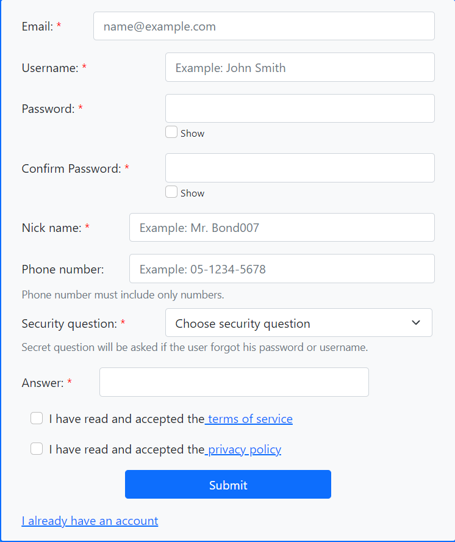
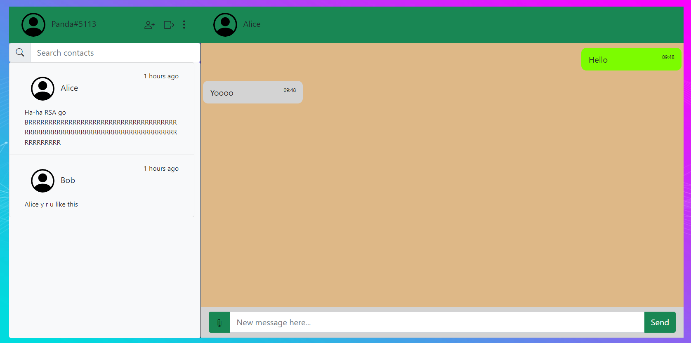

# `Brief`:
A web client, written using the React.JS framework, for our Whatsapp-like messaging application, developed as the project for the Advanced Programming 2 course, Bar-Ilan University, 2022.\
Contains both a version that works with a server and a serverless branch, meant to work locally.\
Due to accidentally adding a file with sensitive information to the original repository, the project was re-uploaded to this repository without the file.\
The server for this app can be found here: https://github.com/YuvalUner/Whatsapp_like_app_web_server
The Android client for this app can be found here: https://github.com/YuvalUner/Whatsapp_like_app_android_client

# Whatsapp-like web-client

### `Authors`:
Yuval Uner, Github: [YuvalUner](https://github.com/YuvalUner).\
Nadav Elgrabli, Github: [NadavElgrabli](https://github.com/NadavElgrabli).

To run the project, use "npm start".\
The root file is index.js.

### `dependencies`
1. React
2. React-Bootstrap
3. React-router / React-router-dom

### `testing`
To test our project, there are hardcoded users, defined as follows:
1. Username: Panda, Password: 2468.
2. Username: Alice, Password: 1234.
3. Username: Bob, Password: 5678.
4. Username: Emily, Password: 1234.
5. Username: Dana, Password: 1234.
6. Username: Mom, Password: 1234.

Most contacts have some built in conversation, with Panda having 5 contacts.\
All of them, however, have only text messages.\
To text for other types of messages, please try sending them, as we were unclear whether 
to include these hard coded types of  messages or not.

# Main Components

## Mandatory components

### `Log-in form`
The home screen of the app when a user is not logged in.

Verifies the validity of the username on log-in and directs them to the main chat app,
or allows them to go to the sign-up form or the forgot password form.

Also lets the user know if they have an error when trying to log in, allows switching between
logging in via username or password, enabling or disabling 
the "remember me" feature, and toggling "show password".

### `Sign-up form`
The form for a new user to sign up.

Allows for inputting all of the vital information, as well as some non-vital information.\
Performs basic checks while the user inputs their information.

### `Main app`
The main part of the project. Allows for conversations between users.

The main app supports sending text, video, image and audio between users.\
It also allows for a user to change their profile picture, description and nickname, as well as 
add contacts to their contacts list, all via the buttons' toolbar to the right of their nickname.

The right side of the screen (the conversation itself) will appear once a contact is chosen.

## Additional, non-mandatory components

There are other features added, however, they are mostly more obvious, and so they were not added 
so as not to clutter this too much.

### `Email verification form`

Currently, all the front end parts of this screen are complete.\
However, we are not sending out the email, as sending an email via the browser
is nonsensical.\
Instead, to bypass this feature, input 111111 (or have fun trying to guess the code).

### `Forgot password form`

A three part process, starting from verifying some of the user's info:

Followed by verifying the user's email using the email verification form, then allowing the user to reset
their password:

After resetting password, the user will be redirected to the log-in screen and have an indication
that they have successfully reset their password.

### `Error checking`

Almost all fields have some manner of error checking to them, alerting 
the user to any error right away.

### `Search contacts`

Allows for searching through contacts, and updates the displayed contacts while typing. 

### `Automatic log-in`

Using cookies, we implemented automatic log-in of users that already signed-in before using cookies.\
If the user chose "remember me", they will be remembered for a period of a week, which will be renewed
upon logging in again.
